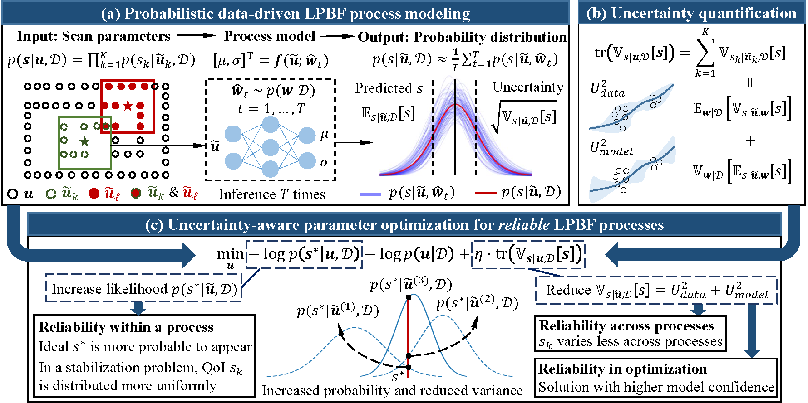

# Uncertainty-Aware Parameter Optimization for Reliable Laser Powder Bed Fusion Additive Manufacturing
This is the official implementation of the paper "Uncertainty-Aware Parameter Optimization for Reliable Laser Powder Bed
Fusion Additive Manufacturing" published on IEEE Transactions on Automation Science and Engineering (TASE).

# Introduction
Laser powder bed fusion (LPBF) is an additive manufacturing process capable of producing intricate structures with high accuracy. Despite this capability, it struggles to achieve required reliability for mass production, specifically in terms of stability within a production run and repeatability across multiple runs. Parameter optimization, which adjusts process parameters to regulate a specific quantity of interest (QoI), is a crucial way for quality control. Existing methods, however, have not adequately addressed both random and systematic factors in the LPBF process. The stochastic nature of the process is often neglected, with the assumption that identical parameter inputs will consistently yield the same QoI. This deviates from the reality, and does not intend to reduce potential variations in a QoI. Moreover, many studies do not incorporate the systematic neighboring effects between scan tracks into optimization. As a result, process reliability cannot be guaranteed. To address this issue, this study focuses on optimizing the probability distribution of a QoI. The key idea is to not only increase the likelihood of achieving the ideal QoI but also reduce its variance. This is achieved by uncertainty-aware modeling and optimization of the LPBF process, utilizing machine learning. Specifically, the problem is formulated as maximizing the posterior distribution of scan parameters given an ideal QoI sequence and historical manufacturing data. This results in a large-scale, constrained optimization problem. A stochastic and distributed gradient-based method is proposed to solve this problem, where a coarse-to-fine strategy plays a critical role to accelerate the optimization. A case study is then conducted to stabilize the melt pool volume by optimizing laser powers. The solutions are verified in a calibrated finite element-based simulation environment, which effectively reduce the variations of the melt pool volume both within a single run and across multiple repeated runs. 



# Installation
Please refer to our previous repository "[probabilistic_melt_pool_model](https://github.com/qihangGH/probabilistic_melt_pool_model)"
to setup the environment

# Toolpath data
Please transform your own toolpath data to an `N-by-3` ndarray (as a .npy file), where `N` is the number of points, and each
row represents the x coordinate, y coordinate, and the laser power of each point. The time gap between each point is a constant `dt` (in second),
which needs to be specified later by the user.

For example, you can use custom slicing software or [PySLM](https://github.com/drlukeparry/pyslm) to generate the toolpath and preprocess it to be the required .npy file.
Then, put the toolpath data in the ```scan_params``` folder. 

We provide a file (```scan_params/warp.npy```) as an example. As shown below,
the "stripe" scan pattern is applied, which uses parallel lines to fill a cross-section. The colorbar denotes the index of each scan point.


# Generate cache
To accelerate the optimization process, it is strongly encouraged to generate the cache of the toolpath data.
Specifically, we generate the neighborhood map of each point in the toolpath beforehand by running:
```
python generate_cache.py \
    -d scan_params/warp.npy \
    -s cache/warp \
    --dt 0.00002 \
    --p_max 250
```
This will save the processed data in the `cache/warp` folder. You can replace `scan_params/warp.npy` with your own toolpath file, and specify the time gap `dt` (in second) and the maximum 
laser power `p_max` (in Watt).

# Melt pool models
The optimization is based on a melt pool model that simulates the manufacturing process.
It receives scan parameters in the neighborhood of a target point and outputs its melt pool behavior.
Please refer to our [previous work](https://github.com/qihangGH/probabilistic_melt_pool_model) and [repository](https://github.com/qihangGH/probabilistic_melt_pool_model) for more details about the melt pool model.

Here we provide two trained melt pool model. 
One is deterministic ([20240504_simu_rd20_128_b256](https://drive.google.com/file/d/1_zHhaVcZ_PGgRUoxHb6Iqrq5uOSUHp9F/view?usp=drive_link)),
and the other is probabilistic ([20240506_simu_stu_rd20_128_b256](https://drive.google.com/file/d/1FrcrbZuLjkFL4nTSDN0nHDcEC5ZqzgbX/view?usp=drive_link)). 
You can first create a `trained_models` folder, then download the model files and put them in this folder.

Alternatively, you can train your own model with your own data follow the "[probabilistic_melt_pool_model](https://github.com/qihangGH/probabilistic_melt_pool_model)" repository to better fit your own additive manufacturing process.

# Optimization
To accelerate optimization, it is more efficient to first optimize with a deterministic model to obtain an initial solution.
Specifically, in the `scan_param_optim` folder (i.e., first `cd scan_param_optim`), run:
```
python optim_conv_simu.py \
    -m ../trained_models/20240504_simu_rd20_128_b256 \
    --scan_info_filepath ../scan_params/warp.npy \
    --scan_cache_dir ../cache/warp \
    --dt 0.00002 \
    --p_max 250 \
    --save_dir opt_warp_det \
    --save_every 1 \
    --test_layer_every 100 \
    --batch_size 3200 \
    --test_layer_batch_size 8000 \
    --downsample_rate 128,64,32,16,8,4,2 \
    --lr 0.2 \
    --window_size 3 \
    --tol 0.128
```
The optimization results will be saved in `scan_param_optim\opt_warp_det`. 
If you encounter out-of-memory error, you can try to reduce `batch_size` and `test_layer_batch_size`.

Then, select one solution as the initial solution for optimizing with a probabilistic model to reduce uncertainty.
For example, we can specify the `warm_start_filepath` argument as `opt_warp_det/80.npy`. Then, in the `scan_param_optim` folder, run
```
python optim_conv_simu.py \
    -m ../trained_models/20240506_simu_stu_rd20_128_b256 \
    --scan_info_filepath ../scan_params/warp.npy \
    --scan_cache_dir ../cache/warp \
    --dt 0.00002 \
    --p_max 250 \
    --save_dir opt_warp_prob \
    --warm_start_filepath opt_warp_det/80.npy \
    --save_every 10 \
    --test_layer_every 10 \
    --batch_size 500 \
    --test_layer_batch_size 3000 \
    --downsample_rate 16,8,4,2 \
    --lr 0.0625 \
    --window_size 4 \
    --tol 0.2
```
The optimization results will be saved in `scan_param_optim\opt_warp_prob`. 

If the number of out-of-bound points (which are printed out during training) are increasing, 
which indicates that the solution becomes infeasible, you can try to reduce the learning rate.

Below we show an example of optimized laser powers.


# Citation
If you find our work and this repository helpful, please consider citing our papers:
```
@article{fang2025uncertainty,
  author={Fang, Qihang and Xiong, Gang and Wang, Fang and Shen, Zhen and Dong, Xisong and Wang, Fei-Yue},
  journal={IEEE Trans. Autom. Sci. Eng.}, 
  title={Uncertainty-Aware Parameter Optimization for Reliable Laser Powder Bed Fusion Additive Manufacturing},
  year={2025},
  pages={1--16}
}
```
The optimization is based on [probabilistic melt pool models](https://github.com/qihangGH/probabilistic_melt_pool_model) developed by our [previous work](https://ieeexplore.ieee.org/document/10632066): 
```
@article{fang2024probabilistic,
  author={Fang, Qihang and Xiong, Gang and Zhao, Meihua and Tamir, Tariku Sinshaw and Shen, Zhen and Yan, Chao-Bo and Wang, Fei-Yue},
  journal={IEEE Trans. Autom. Sci. Eng.}, 
  title={Probabilistic Data-Driven Modeling of a Melt Pool in Laser Powder Bed Fusion Additive Manufacturing}, 
  year={2024},
  pages={1--18},
  doi={10.1109/TASE.2024.3412431}
}
```
You may also be interested in our review paper about [Process Monitoring, Diagnosis and Control of Additive Manufacturing](https://ieeexplore.ieee.org/document/9950053):
```
@article{fang2022process,
  author={Fang, Qihang and Xiong, Gang and Zhou, MengChu and Tamir, Tariku Sinshaw and Yan, Chao-Bo and Wu, Huaiyu and Shen, Zhen and Wang, Fei-Yue},
  journal={IEEE Trans. Autom. Sci. Eng.}, 
  title={Process Monitoring, Diagnosis and Control of Additive Manufacturing}, 
  year={2024},
  volume={21},
  number={1},
  pages={1041--1067},
  doi={10.1109/TASE.2022.3215258}
}
```